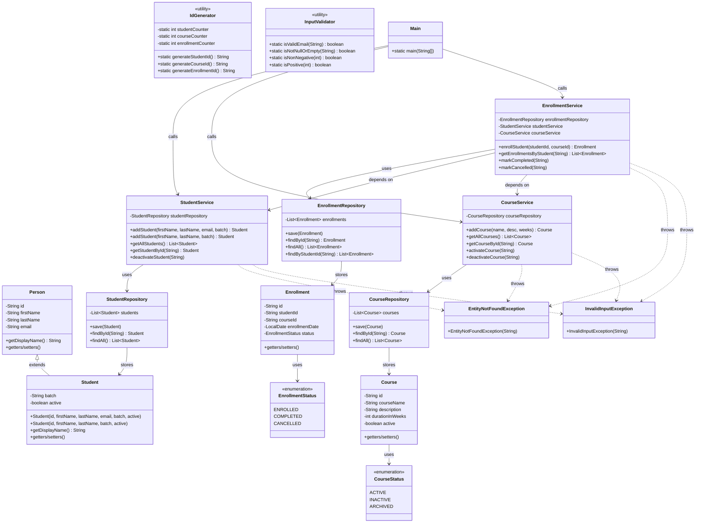

# LearnTrack — Student & Course Management System

> A console-based management system built in **Core Java** to practice fundamental OOP, collections, and clean code principles.

---

## 📖 Project Description

LearnTrack lets an administrator manage **Students**, **Courses**, and **Enrollments** through an interactive menu-driven CLI. All data is stored in-memory (no database), making it easy to compile and run without any external setup.

---

## 🗂️ Directory Structure

```
LearnTrack/
├── pom.xml                          # Maven build file
├── README.md                        # This file
├── docs/
│   ├── Setup_Instructions.md
│   ├── JVM_Basics.md
│   └── Design_Notes.md
└── src/
    └── main/java/com/airtribe/learntrack/
        ├── Main.java                # Entry point & console UI
        ├── entity/
        │   ├── Person.java          # Base class
        │   ├── Student.java         # Extends Person
        │   ├── Course.java
        │   └── Enrollment.java
        ├── repository/              # In-memory ArrayList storage
        │   ├── StudentRepository.java
        │   ├── CourseRepository.java
        │   └── EnrollmentRepository.java
        ├── service/                 # Business logic
        │   ├── StudentService.java
        │   ├── CourseService.java
        │   └── EnrollmentService.java
        ├── exception/
        │   ├── EntityNotFoundException.java
        │   └── InvalidInputException.java
        ├── util/
        │   ├── IdGenerator.java
        │   └── InputValidator.java
        ├── constants/
        │   ├── AppConstants.java
        │   └── MenuOptions.java
        └── enums/
            ├── EnrollmentStatus.java
            └── CourseStatus.java
```

---

## 🏗️ Class Diagram



---

## 🚀 How to Compile & Run

### Prerequisites
- **Java 17+** (JDK)
- **Maven 3.8+** (or use the included Maven wrapper)

### Using Maven (recommended)

```bash
# 1. Compile the project
mvn compile

# 2. Run the application
mvn exec:java -Dexec.mainClass="com.airtribe.learntrack.Main"
```

### Using plain javac / java

```bash
# 1. From the project root, compile all sources
javac -d out -sourcepath src/main/java $(find src/main/java -name "*.java")

# 2. Run
java -cp out com.airtribe.learntrack.Main
```

---

## 🧪 Running Tests

```bash
mvn test
```

---

## 💡 Key Design Decisions

See [`docs/Design_Notes.md`](docs/Design_Notes.md) for a detailed explanation of why ArrayList was chosen, how static members are used, and the inheritance hierarchy.

---

## 👥 Team Roles

| Member | Responsibility |
|--------|---------------|
| 1 | Entities, constructors, inheritance, encapsulation (`entity/`) |
| 2 | Services & business logic, console UI (`service/`, `Main.java`) |
| 3 | Utilities, exceptions, constants, documentation (`util/`, `exception/`, `constants/`, `docs/`) |
